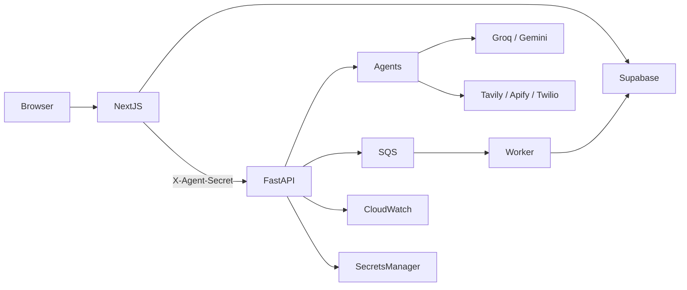

# SkillCrew

Cloud-native **multi-agent learning platform** by **Team Antigravity**. SkillCrew turns onboarding, roadmap planning, resource curation, assessment, engagement, and interview prep into one adaptive loop — not a static course catalog or a single chatbot.

**Stack at a glance:** Next.js 16 (App Router) · FastAPI · Supabase (Auth, Postgres, RLS, optional pgvector) · **Amazon SQS** · **Amazon CloudWatch Logs** · **AWS Secrets Manager** · CrewAI (Agent/Task definitions) · Groq → Gemini LLMs · Razorpay · ElevenLabs · Frame study rooms.

---

## What it does

1. **Onboard** — resume PDF and/or LinkedIn → canonical learner profile (Nova)  
2. **Plan** — dashboard **Build roadmap** → multi-week Archie plan (async job)  
3. **Enrich** — Dexter / Tavily fills real resource links  
4. **Learn** — week-gated modules (≥8 weeks unless micro-course)  
5. **Measure** — Pip MCQ checkpoints (unlock requires score **strictly > 75%**)  
6. **Adapt** — weak topics trigger Archie revise in the background  
7. **Engage** — Sparky WhatsApp / email / digests / streak nudges  
8. **Study together** — Virtual Study Rooms (Frame embeds)  
9. **Optional Job Ready** — Razorpay unlock → ElevenLabs mock interview → coaching analysis  

Closed loop: **Nova → Archie → practice → Pip → Archie revise → Sparky**.

---

## Agents

Product-orchestrated specialists built on the real **CrewAI** package (`crewai.Agent` / `crewai.Task` via [`backend/crewai_compat.py`](backend/crewai_compat.py)). SkillCrew’s `Crew.kickoff` still runs production inference through [`backend/llm_client.py`](backend/llm_client.py) (**Groq → Gemini** JSON) so prompts, schemas, and fallbacks stay controlled — we do **not** use CrewAI’s default LLM loop for production work.

Agents do not freely debate. Next.js authenticated BFF routes call FastAPI `/internal/agents/*` with `X-Agent-Secret`.

**Python:** CrewAI requires **≥3.10 and &lt;3.14** (use 3.12 or 3.13). Prefer `backend/.venv313` over broken/`3.14` venvs.

| Agent | Role | Notes |
| :--- | :--- | :--- |
| **Nova** | Intake / profile merge | Deterministic merge (no LLM) of LinkedIn + resume |
| **Archie** | Roadmap architect | Structured JSON, ≥8 weeks, empty `resources[]`; revises from Pip |
| **Dexter** | Resource curator | Tavily (preferred) or Apify Google Search; hostname bucketing |
| **Pip** | Assessment | LLM builds MCQs; **deterministic** grading by `correct_index` |
| **Sparky** | Engagement | Compose + Twilio / Resend / SendGrid; prefs, digests, cooldowns |
| **Coach** | Chat companion | Empathy, pace prefs, revise *signals* — does **not** create roadmaps |

**Hallucination controls:** no LLM merge (Nova); no invented URLs (Archie leaves links empty; Dexter searches); schema + remediation for short roadmaps; deterministic quiz grading; chat ≠ Build roadmap.

---

## Key product features

- Domain-agnostic roadmaps (engineering, marketing, etc.) from direction + profile + optional syllabus PDF / YouTube playlist  
- Week gates, XP, streaks, leaderboard, revision lab  
- Adaptive revise loop after Pip checkpoints  
- Optional **pgvector** semantic cache for Coach (`agent_cache` + OpenAI embeddings)  
- **Job Ready** portal: Razorpay order + HMAC verify, company research, ElevenLabs mock interview, analysis (Groq → Gemini)  
- **Virtual Study Rooms**: Frame iframe embeds (`/study-room`) + QR helper for pinning links back into rooms  
- Async Archie generation via **Amazon SQS** (or `inline` / `auto` with FastAPI `BackgroundTasks`)  
- Production ops via **Amazon CloudWatch Logs** + optional **AWS Secrets Manager**  

---

## Architecture

```
Browser
  → Next.js (Supabase Auth, App Router, BFF API routes)
      → Supabase Postgres (RLS for user data; service role for workers/webhooks)
      → proxyAgent + X-Agent-Secret
          → FastAPI /internal/agents/*
              → Nova / Archie / Dexter / Pip / Sparky / Coach
              → Groq → Gemini, Tavily, Apify, Twilio, Resend
              → SQS → roadmap worker → update job + roadmap rows
              → CloudWatch Logs (Watchtower)
              → Secrets Manager (optional key load)
```



**Auth layers:** Supabase JWT + RLS · `BACKEND_AGENT_SECRET` · optional `CRON_SECRET` · Razorpay HMAC · AWS IAM for SQS / CloudWatch / Secrets Manager.

---

## Amazon CloudWatch (ops telemetry)

FastAPI attaches a **Watchtower** `CloudWatchLogHandler` when an AWS Logs client can be created from the shared boto3 session ([`backend/main.py`](backend/main.py)).

| Setting | Value |
| :--- | :--- |
| Log group | `SkillCrew-Production` |
| Log stream | `Backend-FastAPI` |
| Library | `watchtower` + `boto3` |
| Level | INFO+ (same format as console: timestamp, level, logger, message) |

**What CloudWatch is used for**

- Centralized production logs for the agent backend (no SSH required to debug)  
- Roadmap job timings, enrich mode, LLM fallback warnings, errors, worker-related failures when those paths log through the root logger  
- Operational visibility under load alongside SQS queue depth (queue metrics are separate CloudWatch/SQS metrics if you enable them in AWS)  

**What CloudWatch is *not***

- Not automatic LLM **token / cost** accounting (use Groq/Gemini dashboards or explicit instrumentation)  
- Not a substitute for application metrics dashboards unless you add custom metrics  
- If AWS credentials or the Logs client are unavailable, the app **keeps running** and logs to **console only** (handler attach is best-effort)

**IAM (typical):** `logs:CreateLogGroup`, `logs:CreateLogStream`, `logs:PutLogEvents` (and related describe permissions as needed) on the production log group, plus whatever your deploy role already uses for SQS/Secrets Manager.

**Env:** standard AWS credentials — `AWS_ACCESS_KEY_ID`, `AWS_SECRET_ACCESS_KEY`, `AWS_REGION` / `AWS_DEFAULT_REGION` (or an instance/task role). No separate `CLOUDWATCH_*` app env is required for the default Watchtower wiring.

---

## Amazon SQS & Secrets Manager

### SQS (async roadmaps)

Roadmap generation can take minutes (LLM + enrichment). Under burst traffic, sync HTTP would time out.

- API enqueues a job → writes `roadmap_generation_jobs` → pushes SQS → returns **202** + `job_id`  
- Worker ([`run_archie_roadmap_sqs_worker.py`](backend/run_archie_roadmap_sqs_worker.py)) long-polls, runs Archie + enrich, updates job status, deletes the message  
- Modes: `ARCHIE_ROADMAP_QUEUE_MODE=auto|sqs|inline` (`auto` tries SQS then falls back to FastAPI `BackgroundTasks`)  

**Honesty for interviews / ops:** SQS improves **burst acceptance and resilience**. It does **not** make a single LLM roadmap faster.

### Secrets Manager (optional)

When configured, FastAPI can load sensitive values (e.g. Gemini / Supabase service role) from **AWS Secrets Manager** via named secrets, falling back to `.env` if ASM is unavailable. Never log secret values.

---

## Virtual Study Rooms (Frame)

SkillCrew embeds third-party [Frame](https://framevr.io) spaces on `/study-room` (dashboard chrome kept — not a fullscreen takeover). Config: [`frontend/lib/config/studyRooms.ts`](frontend/lib/config/studyRooms.ts).

| SkillCrew slug | Frame space | URL |
| :--- | :--- | :--- |
| `study-hall` | `atharva` | https://framevr.io/atharva |
| `milestone` | `milestone` | https://framevr.io/milestone |
| `review` | `reviewer` | https://framevr.io/reviewer |

- Iframe allowlist: camera, microphone, display-capture, xr-spatial-tracking, fullscreen  
- **Open in new tab** fallback if embed / mic permissions fail  
- Content inside rooms is curated **manually** in Frame (no Frame public API in this integration)  
- QR helper: `/study-room/qr?url=…&label=…` (URL must start with the app origin or `https://`) for screenshot pins  

Nav: **Study Rooms** in the sidebar. Milestone cards and Revision Lab link into the matching room.

---

## Job Ready portal

- Paywall via **Razorpay** Checkout; server creates order; unlock only after **HMAC signature verify**  
- Never trust a client `paid` flag; card data never hits SkillCrew servers  
- After unlock: company research, recent jobs, **ElevenLabs** mock voice interview, coaching analysis (Groq → Gemini fallback)  

---

## Repository layout

```
learning-platform/
├── frontend/                 # Next.js 16 app (UI + BFF API routes)
│   ├── app/                  # App Router pages + /api/*
│   ├── components/           # dashboard, job-ready, study-room, layout, ui
│   └── lib/                  # supabase, agents proxies, config/studyRooms.ts
├── backend/                  # FastAPI agents, workers, AWS integrations
│   ├── main.py               # App entry, CloudWatch Watchtower, Secrets Manager, CORS
│   ├── agents_api.py         # /internal/agents/* (X-Agent-Secret)
│   ├── *_agent.py            # Nova, Archie, Dexter, Pip, Sparky, Coach
│   ├── crewai_compat.py      # Real crewai.Agent/Task + SkillCrew kickoff → llm_client
│   ├── llm_client.py         # Groq JSON → Gemini fallback
│   ├── roadmap_worker.py     # Archie generate + Tavily enrich
│   └── run_archie_roadmap_sqs_worker.py
├── supabase/
│   ├── migrations/
│   └── scripts/              # full_schema_bootstrap.sql, FRESH_START.md
├── scripts/                  # progress PDF helper
├── package.json              # Proxies npm scripts to frontend/
└── requirements.txt          # Includes backend/requirements.txt
```

---

## Tech stack

| Layer | Choices |
| :--- | :--- |
| Frontend | Next.js 16, React 19, Tailwind CSS 4, Framer Motion, Zustand, Zod, Lucide |
| Auth / DB | Supabase Auth, Postgres, RLS, optional **pgvector** (`agent_cache`) |
| Backend | FastAPI, Uvicorn, Pydantic Settings, Supabase Python client, **CrewAI** |
| LLMs | Groq (`llama-3.3-70b-versatile`) → Gemini Flash family via `llm_client` |
| Search / scrape | Tavily, Apify, Firecrawl fallback, pypdf |
| Media | yt-dlp, youtube-transcript-api |
| Messaging | Twilio (WhatsApp/SMS/voice), Resend / SendGrid |
| AWS | **SQS**, **CloudWatch Logs** (Watchtower), **Secrets Manager**, boto3 |
| Payments / interview | Razorpay, `@elevenlabs/react` |
| Study rooms | Frame (iframe + deep links), `qrcode.react` |

---

## Prerequisites

- Node.js 20+ (frontend)  
- Python **3.12 or 3.13** for backend (CrewAI: `>=3.10,<3.14`)  
- Supabase project with schema applied  
- At least one LLM key: `GROQ_API_KEY` and/or `GOOGLE_API_KEY`  
- Optional AWS credentials for SQS / CloudWatch / Secrets Manager  

---

## Environment

Copy examples and fill real values. **`BACKEND_AGENT_SECRET` must match** on frontend and backend.

| File | Purpose |
| :--- | :--- |
| `frontend/.env` / `.env.local` | See `frontend/.env.example` |
| `backend/.env` | See `backend/.env.example` |
| Repo root `.env` / `.env.example` | Shared Razorpay keys (Next also loads parent env) |

**Minimum for core loop**

```env
# frontend
NEXT_PUBLIC_SUPABASE_URL=
NEXT_PUBLIC_SUPABASE_ANON_KEY=
SUPABASE_SERVICE_ROLE_KEY=
BACKEND_URL=http://127.0.0.1:8000
BACKEND_AGENT_SECRET=

# backend
BACKEND_AGENT_SECRET=   # same value
SUPABASE_URL=
SUPABASE_SERVICE_ROLE_KEY=
GROQ_API_KEY=           # and/or GOOGLE_API_KEY
ARCHIE_ROADMAP_QUEUE_MODE=inline   # local without AWS
```

**Optional / production**

| Feature | Vars |
| :--- | :--- |
| Resource search | `TAVILY_API_KEY`, `APIFY_API_TOKEN` |
| LinkedIn scrape | `APIFY_API_TOKEN` (Firecrawl if configured) |
| Sparky | Twilio + `RESEND_API_KEY` / SendGrid; `CRON_SECRET` |
| Coach semantic cache | `OPENAI_API_KEY` + pgvector |
| Job Ready | `NEXT_PUBLIC_RAZORPAY_KEY_ID`, `RAZORPAY_KEY_SECRET`, … |
| Mock interview | `NEXT_PUBLIC_ELEVENLABS_AGENT_ID`; Groq/Gemini for analyze |
| SQS | `AWS_*`, `SQS_SKILLCREW_TASK_QUEUE_URL` or name, `ARCHIE_ROADMAP_QUEUE_MODE=sqs\|auto` |
| **CloudWatch / AWS region** | `AWS_ACCESS_KEY_ID`, `AWS_SECRET_ACCESS_KEY`, `AWS_REGION` (or task role) |
| Secrets Manager | `*_SECRET_NAME` style settings when used (see `main.py` Settings) |
| CORS (prod FastAPI) | `CORS_ORIGINS=https://your-frontend.vercel.app` |
| Browser→API helpers | `NEXT_PUBLIC_API_URL=https://your-fastapi-host` |
| Enrich speed | `ARCHIE_TAVILY_ENRICH_MODE=off\|fast\|full` |

---

## Database (Supabase)

Follow **`supabase/scripts/FRESH_START.md`**:

1. Enable extensions: `uuid-ossp`, **`vector`** (pgvector)  
2. Run `supabase/scripts/full_schema_bootstrap.sql`  
3. Auth → Site URL + redirect URLs for local (`http://localhost:3000`) and production  

Incremental migrations: `supabase/migrations/`. If vector operators fail: `supabase/scripts/fix_vector_operators.sql`.

---

## Run locally

Two terminals. Prefer **Python 3.12/3.13**.

### 1. Backend (port 8000)

```bash
cd backend
/usr/local/bin/python3.13 -m venv .venv313   # if needed
source .venv313/bin/activate
pip install -r requirements.txt
python main.py
# or: uvicorn main:app --reload --host 127.0.0.1 --port 8000
```

API docs: http://127.0.0.1:8000/docs · Health: `GET /api/health`

### 2. Frontend (port 3000)

```bash
npm install --prefix frontend
npm run dev
```

Open http://localhost:3000 → sign up → onboarding → **Build roadmap**.

### 3. Optional SQS worker

```bash
cd backend && source .venv313/bin/activate
python run_archie_roadmap_sqs_worker.py
```

Only when using real SQS (not `inline`).

---

## Deploy (production overview)

SkillCrew is **three services**: Supabase + Next.js host + FastAPI host (+ optional SQS worker).

| Piece | Typical host | Notes |
| :--- | :--- | :--- |
| DB / Auth | Supabase | Schema bootstrap + Auth redirects to frontend URL |
| Frontend | **Vercel** — Root Directory `frontend` | Set `BACKEND_URL`, matching `BACKEND_AGENT_SECRET`, Supabase keys |
| Backend | **Railway / Render** — Root `backend`, Python 3.12/3.13 | Start: `uvicorn main:app --host 0.0.0.0 --port $PORT` (not `python main.py`) |
| Ops | AWS | CloudWatch log group `SkillCrew-Production`; optional SQS + Secrets Manager |

**Must set in prod**

1. `BACKEND_URL` / `NEXT_PUBLIC_API_URL` → public FastAPI HTTPS  
2. `CORS_ORIGINS` → frontend origin(s)  
3. Same `BACKEND_AGENT_SECRET` on both apps  
4. Supabase Site URL + `/auth/callback` redirects  
5. At least one LLM key on FastAPI  

Do **not** run production with uvicorn bound to `127.0.0.1` only.

---

## Important product rules

| Topic | Behavior |
| :--- | :--- |
| Create roadmap | Dashboard **Build roadmap** inserts a new row — Coach chat does not |
| Pip unlock | Score must be **strictly greater than 75%** |
| Agent security | Browser never calls FastAPI agents with secrets; BFF proxies |
| Payments | Unlock only after server-side Razorpay **HMAC** verify |
| SQS | Throughput / resilience under burst — not lower LLM latency |
| **CloudWatch** | Ops log sink for FastAPI — **not** automatic token billing |

---

## Scripts & extras

- `scripts/generate_report.py` — progress PDF helper (analytics report route; may need Python on the Next host)  
- `backend/test_learning_continuity_*.py` — learning continuity tests  
- `supabase/scripts/fix_vector_operators.sql` — pgvector operator fix  

---

## License / team

Built by **Team Antigravity** as SkillCrew. Align any public metrics (e.g. relevance lift) with what you can measure and defend.
