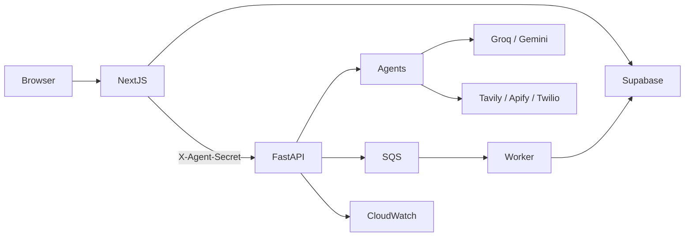

# SkillCrew

Cloud-native **multi-agent learning platform** by **Team Antigravity**. SkillCrew turns onboarding, roadmap planning, resource curation, assessment, engagement, and interview prep into one adaptive loop — not a static course catalog or a single chatbot.

**Stack:** Next.js 16 (App Router) + FastAPI + Supabase (Postgres Auth/RLS) + Amazon SQS + CloudWatch · LLMs via Groq → Gemini fallback · Job Ready via Razorpay + ElevenLabs.

---

## What it does

1. **Onboard** — resume PDF and/or LinkedIn → canonical learner profile  
2. **Plan** — dashboard **Build roadmap** → multi-week Archie plan (async job)  
3. **Enrich** — Dexter/Tavily fills real resource links  
4. **Learn** — week-gated modules  
5. **Measure** — Pip MCQ checkpoints (pass requires **score > 75%**)  
6. **Adapt** — weak topics trigger Archie revise in the background  
7. **Engage** — Sparky WhatsApp / email / digests / streak nudges  
8. **Optional Job Ready** — Razorpay unlock → ElevenLabs mock interview → coaching analysis  

Closed loop: **Nova → Archie → practice → Pip → Archie revise → Sparky**.

---

## Agents

Product-orchestrated specialists built on the real **CrewAI** package (`crewai.Agent` / `crewai.Task` via [`backend/crewai_compat.py`](backend/crewai_compat.py)). SkillCrew’s `Crew.kickoff` still runs production inference through [`llm_client.py`](backend/llm_client.py) (**Groq → Gemini** JSON) so prompts, schemas, and fallbacks stay controlled — we do **not** use CrewAI’s default LLM loop. Agents do not freely debate; Next.js authenticated routes call FastAPI `/internal/agents/*` with `X-Agent-Secret`.

**Python:** CrewAI requires **≥3.10 and &lt;3.14** (e.g. 3.12 or 3.13). Use a matching venv under `backend/` (e.g. `.venv313`).

| Agent | Role | Notes |
| :--- | :--- | :--- |
| **Nova** | Intake / profile merge | Deterministic merge (no LLM) of LinkedIn + resume skills/experience |
| **Archie** | Roadmap architect | Structured JSON, ≥8 weeks, empty `resources[]`; revises from Pip signals |
| **Dexter** | Resource curator | Tavily search (Apify Google Search fallback); hostname bucketing |
| **Pip** | Assessment | LLM builds MCQs; **deterministic** grading by `correct_index` |
| **Sparky** | Engagement | Compose + Twilio/Resend dispatch; prefs, digests, cooldowns |
| **Coach** | Chat companion | Empathy, pace prefs, revise *signals* — does **not** create roadmaps |

**Hallucination controls:** no LLM merge (Nova), no invented URLs (Archie leaves links empty; Dexter searches), schema + remediation for short roadmaps, deterministic quiz grading, chat ≠ Build roadmap.

---

## Key product features

- Domain-agnostic roadmaps (engineering, marketing, etc.) from direction + profile + optional syllabus PDF / YouTube playlist  
- Week gates + XP / streaks / leaderboard  
- Adaptive revise loop after checkpoints  
- Optional **pgvector** semantic cache for Coach (`agent_cache` + OpenAI embeddings)  
- **Job Ready** portal: Razorpay order + HMAC verify, company research, mock voice interview (ElevenLabs), analysis (Groq → Gemini)  
- Async Archie generation via **SQS** (or `inline` / `auto` fallback with FastAPI `BackgroundTasks`)  
- Ops logs to **CloudWatch** (`SkillCrew-Production` / `Backend-FastAPI`) when AWS is configured  

---

## Architecture

```
Browser
  → Next.js (Supabase Auth, App Router, BFF API routes)
      → Supabase Postgres (RLS for user data; service role for workers/webhooks)
      → proxyAgent + X-Agent-Secret
          → FastAPI /internal/agents/*
              → Nova / Archie / Dexter / Pip / Sparky / Coach
              → Groq → Gemini, Tavily, Apify, Twilio, Resend
              → SQS → roadmap worker → update job + roadmap rows
```



**Auth layers:** Supabase JWT + RLS · `BACKEND_AGENT_SECRET` · optional `CRON_SECRET` · Razorpay HMAC · AWS IAM for SQS/CloudWatch/Secrets Manager.

---

## Repository layout

```
learning-platform/
├── frontend/                 # Next.js 16 app (UI + API routes as BFF)
├── backend/                  # FastAPI agents, workers, integrations
│   ├── main.py               # App entry (uvicorn on :8000)
│   ├── agents_api.py         # /internal/agents/* (secret-protected)
│   ├── *_agent.py            # Nova, Archie, Dexter, Pip, Sparky, Coach
│   ├── crewai_compat.py      # Real crewai.Agent/Task + SkillCrew kickoff → llm_client
│   ├── llm_client.py         # Groq JSON → Gemini fallback
│   ├── roadmap_worker.py     # Archie generate + enrich
│   └── run_archie_roadmap_sqs_worker.py
├── supabase/
│   ├── migrations/           # Incremental SQL
│   └── scripts/              # full_schema_bootstrap.sql, FRESH_START.md
├── scripts/                  # e.g. progress PDF report helper
├── package.json              # Proxies npm scripts to frontend/
└── requirements.txt          # Includes backend/requirements.txt
```

---

## Tech stack

| Layer | Choices |
| :--- | :--- |
| Frontend | Next.js 16, React 19, Tailwind CSS 4, Framer Motion, Zustand, Zod, Lucide |
| Auth / DB | Supabase Auth, Postgres, RLS, optional **pgvector** (`agent_cache`) |
| Backend | FastAPI, Uvicorn, Pydantic Settings, Supabase Python client, **CrewAI** (Agent/Task defs) |
| LLMs | Groq (`llama-3.3-70b-versatile` default) → Gemini Flash family fallback via `llm_client` |
| Search / scrape | Tavily, Apify (LinkedIn + Google Search), Firecrawl fallback, pypdf |
| Media | yt-dlp, youtube-transcript-api |
| Messaging | Twilio (WhatsApp/SMS/voice), Resend / SendGrid |
| Async / ops | Amazon SQS, boto3, Watchtower → CloudWatch Logs, Secrets Manager |
| Payments / interview | Razorpay, `@elevenlabs/react` Agents |

---

## Prerequisites

- Node.js 20+ (frontend)  
- Python 3.11+ recommended (backend; prefer a local venv — avoid broken copied envs)  
- Supabase project with schema applied (see below)  
- At least one LLM key: `GROQ_API_KEY` and/or `GOOGLE_API_KEY`  

---

## Environment

Copy examples and fill real values. **`BACKEND_AGENT_SECRET` must match** on frontend and backend.

| File | Purpose |
| :--- | :--- |
| `frontend/.env` / `.env.local` | See `frontend/.env.example` |
| `backend/.env` | See `backend/.env.example` |
| Repo root `.env` / `.env.example` | Shared Razorpay public/server keys (Next also loads parent env) |

**Minimum for core loop**

```env
# frontend
NEXT_PUBLIC_SUPABASE_URL=
NEXT_PUBLIC_SUPABASE_ANON_KEY=
SUPABASE_SERVICE_ROLE_KEY=
BACKEND_URL=http://127.0.0.1:8000
BACKEND_AGENT_SECRET=

# backend
BACKEND_AGENT_SECRET=   # same value
SUPABASE_URL=
SUPABASE_SERVICE_ROLE_KEY=
GROQ_API_KEY=           # and/or GOOGLE_API_KEY
ARCHIE_ROADMAP_QUEUE_MODE=inline   # local without AWS
```

**Optional**

| Feature | Vars |
| :--- | :--- |
| Resource search | `TAVILY_API_KEY`, `APIFY_API_TOKEN` |
| LinkedIn scrape | `APIFY_API_TOKEN` (Firecrawl if configured) |
| Sparky | Twilio + `RESEND_API_KEY` / SendGrid; `CRON_SECRET` |
| Coach semantic cache | `OPENAI_API_KEY` + pgvector `agent_cache` |
| Job Ready paywall | `NEXT_PUBLIC_RAZORPAY_KEY_ID`, `RAZORPAY_KEY_SECRET`, … |
| Mock interview | `NEXT_PUBLIC_ELEVENLABS_AGENT_ID`, `GROQ_API_KEY` / Gemini for analyze |
| SQS production | `AWS_*`, `SQS_SKILLCREW_TASK_QUEUE_URL` or name, `ARCHIE_ROADMAP_QUEUE_MODE=sqs\|auto` |
| Enrich speed | `ARCHIE_TAVILY_ENRICH_MODE=off\|fast\|full` |

---

## Database (Supabase)

For a new project, follow **`supabase/scripts/FRESH_START.md`**:

1. Enable extensions: `uuid-ossp`, **`vector`** (pgvector)  
2. Run `supabase/scripts/full_schema_bootstrap.sql` in the SQL Editor  
3. Auth → Site URL `http://localhost:3000`, redirect URLs for local/prod  

Incremental migrations live under `supabase/migrations/`.

---

## Run locally

Two terminals. Prefer **Python 3.12 or 3.13** for the backend (CrewAI requires `>=3.10,<3.14`). Avoid the broken `backend/venv` and Python 3.14 `.venv` if present — use e.g. `backend/.venv313`.

### 1. Backend (port 8000)

```bash
cd backend
# Example with Python 3.13:
/usr/local/bin/python3.13 -m venv .venv313
source .venv313/bin/activate
pip install -r requirements.txt
python main.py
# equivalent: uvicorn main:app --reload --host 127.0.0.1 --port 8000
```

API docs: [http://127.0.0.1:8000/docs](http://127.0.0.1:8000/docs)

### 2. Frontend (port 3000)

```bash
# from repo root
npm install --prefix frontend
npm run dev
# or: cd frontend && npm run dev
```

Open [http://localhost:3000](http://localhost:3000) → sign up → onboarding → **Build roadmap**.

### 3. Optional SQS worker

Only when using real SQS (not `inline`):

```bash
cd backend
source .venv/bin/activate
python3 run_archie_roadmap_sqs_worker.py
```

**Note:** SQS improves burst acceptance / resilience. It does **not** make a single LLM roadmap faster.

---

## Important product rules

| Topic | Behavior |
| :--- | :--- |
| Create roadmap | Dashboard **Build roadmap** inserts a new row — Coach chat does not |
| Pip unlock | Score must be **strictly greater than 75%** |
| Agent security | Never call FastAPI agents from the browser |
| Payments | Unlock only after server-side Razorpay **HMAC** verify |
| CloudWatch | Ops telemetry for FastAPI — not automatic token billing |

---

## Scripts & extras

- `scripts/generate_report.py` — progress PDF helper (used by analytics report route)  
- `backend/test_learning_continuity_*.py` — learning continuity tests  
- `supabase/scripts/fix_vector_operators.sql` — if pgvector operators fail after bootstrap  

---

## Virtual Study Rooms (powered by Frame)

SkillCrew embeds third-party [Frame](https://framevr.io) spaces in an iframe on `/study-room`. Room URLs live in `frontend/lib/config/studyRooms.ts` (placeholders until you create spaces in Frame and paste the real links). Content inside each room — whiteboards, pinned links, QR codes to quizzes — is curated manually per milestone; Frame has no public API, so SkillCrew cannot place objects or content programmatically.

A screenshot-friendly QR helper is available at `/study-room/qr?url=…&label=…` for printing codes to pin inside Frame. Future work could include self-hosted Three.js or networked-aframe rooms; that is not part of the current embed integration.

---

## License / team

Built by **Team Antigravity** as SkillCrew. Align any public metrics (e.g. relevance lift) with what you can measure and defend.
